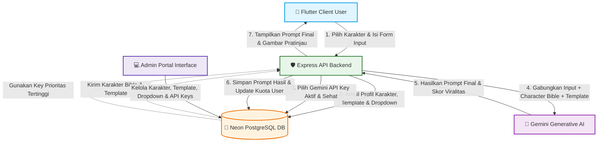

# 🎨 AI Poster Prompt Studio 🚀
[](https://flutter.dev)
[](https://react.dev)
[](https://expressjs.com)
[](https://orm.drizzle.team)
[](https://deepmind.google/technologies/gemini/)

> **AI Poster Prompt Studio** adalah platform *full-stack* modern yang dirancang untuk menghasilkan prompt poster yang sangat teroptimasi, konsisten, dan memiliki daya tarik viral tinggi (misalnya untuk Bing Image Creator, Midjourney, Stable Diffusion, atau DALL-E 3). Platform ini menggunakan integrasi AI Gemini melalui rotasi API key, sistem konsistensi karakter (Character Bible), template prompt dinamis, dan sistem manajemen admin yang komprehensif.

---

## 📸 Demo & Tampilan Antarmuka (Admin Portal)

Berikut adalah beberapa tampilan fitur manajemen sistem pada Admin Portal (**React + TanStack Start**):

| Fitur | Cuplikan Layar | Deskripsi |
| :--- | :--- | :--- |
| **Dashboard Utama Admin** |  | Halaman utama admin yang menampilkan ringkasan data, grafik statistik, jumlah pengguna, voucher aktif, dan kuota API. |
| **Manajemen Dropdown Dinamis** |  | Pengaturan dropdown pilihan dinamis yang akan dirender secara real-time pada aplikasi Flutter Client. |
| **Informasi Form & Deskripsi** |  | Mengelola konfigurasi label, sub-deskripsi, dan metadata formulir input untuk setiap jenis poster/layanan. |
| **Manajemen API Keys Gemini** |  | Mengelola kolam (*pool*) API Key Gemini dengan sistem enkripsi, deteksi status kesehatan, prioritas rotasi, dan pencatatan riwayat pemakaian. |
| **Log Audit & Detektor Error** |  | Sistem monitoring log audit real-time untuk mendeteksi error integrasi AI, aktivitas user, dan performa backend. |
| **Katalog Template Prompt AI** |  | Daftar template prompt yang dapat disesuaikan oleh admin untuk menentukan formula pembuatan prompt AI yang viral. |
| **Pembuat & Editor Template** |  | Editor interaktif untuk membuat struktur template prompt baru lengkap dengan variabel dinamis, hook viral, dan analisis AI. |
| **Manajemen Karakter (Character Bible)** |  | Database karakter yang menyimpan profil konsistensi prompt, Master Prompt, Positive/Negative Prompts, dan aset gambar referensi. |

---

## 🗺️ Struktur Dokumentasi Proyek

Untuk mempermudah pemahaman dan instalasi proyek ini, kami membagi dokumentasi menjadi beberapa sub-dokumen terperinci:

*   📖 **[Dokumentasi Arsitektur & Skema Database (docs/ARCHITECTURE.md)](docs/ARCHITECTURE.md)**
    *   Detail arsitektur full-stack sistem, diagram relasi database menggunakan Drizzle ORM, alur eksekusi Gemini AI, dan workflow sistem.
*   ⚙️ **[Panduan Instalasi & Konfigurasi (docs/INSTALLATION.md)](docs/INSTALLATION.md)**
    *   Cara menginstal, mengonfigurasi variabel lingkungan (`.env`), menjalankan server backend (Node.js), portal admin (React), dan aplikasi klien (Flutter).
*   ⭐ **[Panduan Fitur Utama (docs/FEATURES.md)](docs/FEATURES.md)**
    *   Penjelasan mendalam tentang *Character Bible & Consistency*, *AI Prompt Engine*, *Gemini API Key Rotation*, dan *License Voucher System*.
*   🤝 **[Panduan Kontribusi & Standar Kode (docs/CONTRIBUTING.md)](docs/CONTRIBUTING.md)**
    *   Panduan bagi pengembang yang ingin melakukan kontribusi, konvensi kode, struktur direktori repositori secara penuh, dan pengelolaan migrasi database.

---

## ⚙️ Ringkasan Alur Kerja Sistem (End-to-End Workflow)

Berikut adalah diagram alur bagaimana pengguna (melalui aplikasi Flutter) meminta pembuatan poster, dan bagaimana Backend memprosesnya menggunakan template, profil karakter dari **Character Bible**, dan rotasi API Key Gemini untuk mengembalikan prompt final yang siap pakai:



---

## ⚡ Fitur Utama

1.  **Character Bible (Konsistensi Karakter)**: Menyimpan detail deskripsi visual karakter (pakaian, rambut, wajah) agar ketika AI men-generate prompt gambar berkali-kali, karakter yang dihasilkan tetap sama (konsisten).
2.  **Rotasi API Key Otomatis**: Backend secara cerdas merotasi API Key Gemini dari kolam kunci yang aktif berdasarkan tingkat penggunaan dan status kesehatan kunci tersebut, menghindari *Rate Limit* atau kegagalan pemanggilan.
3.  **Dynamic Form Renderer**: Struktur form di aplikasi Flutter dimotori secara dinamis oleh konfigurasi dari database yang dikontrol sepenuhnya melalui Admin Panel.
4.  **Sistem Voucher Lisensi**: Mengisi kredit atau masa berlaku paket subscription pengguna menggunakan kode voucher lisensi yang dihasilkan oleh admin.
5.  **Drizzle ORM & Postgres (Neon DB)**: Integrasi database modern berkecepatan tinggi dengan tipe data aman menggunakan TypeScript.

---

## 🚀 Memulai Cepat (Quick Start)

Untuk menjalankan seluruh ekosistem ini secara lokal di komputer Anda, Anda dapat menggunakan script launcher otomatis `run_all.bat` yang sudah disediakan:

```bash
# Jalankan launcher
.\run_all.bat
```

Script ini akan otomatis melakukan:
1.  Menjalankan backend API server pada port `3000`.
2.  Menjalankan aplikasi Flutter Web di browser Chrome.

*Catatan: Kredensial default untuk Admin Portal:*
*   **Email**: `admin@promptstudio.com`
*   **Password**: `admin123`

---

## 🛡️ Lisensi & Hak Cipta

Proyek ini dibuat untuk portofolio dan penggunaan internal. Hak cipta dilindungi oleh pengembang repositori [dresar/ai_poster_prompt_studio](https://github.com/dresar/ai_poster_prompt_studio).
