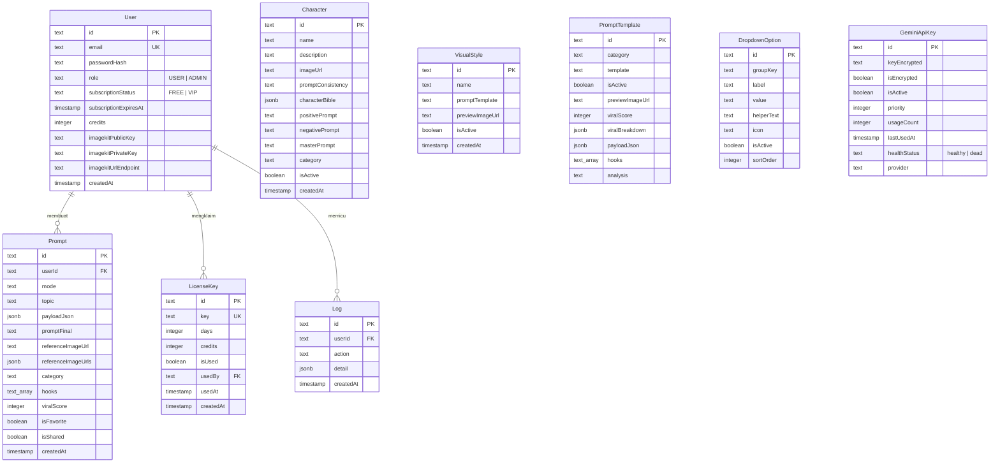
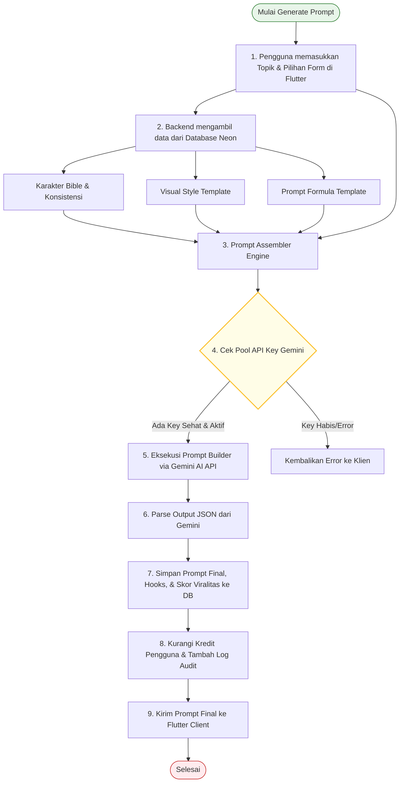

# 🏛️ Arsitektur Sistem & Database - AI Poster Prompt Studio

Dokumen ini merinci arsitektur perangkat lunak, desain database, dan alur integrasi AI dari proyek **AI Poster Prompt Studio**.

---

## 🌐 Arsitektur Ekosistem (System Architecture)

Sistem ini didesain menggunakan arsitektur **Three-Tier** modern yang memisahkan antara Presentation Layer, Application Layer, dan Data Layer:

```mermaid
graph TD
    subgraph Presentation Layer [📱 Presentation Layer]
        Flutter[📱 Flutter Client Mobile/Web <br>Riverpod + GoRouter]
        React[💻 React Admin Portal <br>TanStack Start + Tailwind v4]
    end

    subgraph Application Layer [🛡️ Application Layer]
        Express[Express.js Server <br>Node.js + TypeScript]
        Auth[JWT & Bcrypt Auth Middleware]
        PromptEngine[AI Prompt Engine]
        Logger[Winston Logger & Audit Logs]
    end

    subgraph Data & AI Services [💾 Data & AI Services]
        DB[(Neon PostgreSQL Database)]
        Drizzle[Drizzle ORM Mapping]
        Gemini[Google Gemini API Pool]
    end

    %% Hubungan antar layer
    Flutter -->|REST API Requests JSON| Express
    React -->|REST API Requests JSON| Express
    Express --> Auth
    Express --> PromptEngine
    Express --> Logger
    PromptEngine --> Drizzle
    Drizzle --> DB
    PromptEngine -->|Generative Text Request| Gemini
    
    %% Styling
    style Presentation Layer fill:#f9f9f9,stroke:#333,stroke-width:1px;
    style Application Layer fill:#f5f5f5,stroke:#333,stroke-width:1px;
    style Data & AI Services fill:#f0f0f0,stroke:#333,stroke-width:1px;
    style Flutter fill:#e1f5fe,stroke:#0288d1,stroke-width:2px;
    style React fill:#ede7f6,stroke:#5e35b1,stroke-width:2px;
    style Express fill:#e8f5e9,stroke:#2e7d32,stroke-width:2px;
    style DB fill:#fff3e0,stroke:#e65100,stroke-width:2px;
    style Gemini fill:#f3e5f5,stroke:#7b1fa2,stroke-width:2px;
```

---

## 💾 Skema & Relasi Database (Database Schema ERD)

Database menggunakan **PostgreSQL** yang diinangi di **Neon DB Serverless**. Struktur tabel dipetakan menggunakan **Drizzle ORM**. Berikut adalah representasi Entity-Relationship Diagram (ERD) dari database kita:



---

## 🤖 Alur Rekayasa Prompt AI (AI Prompt Engineering Flow)

Mekanisme utama pembuatan prompt menggabungkan masukan variabel pengguna dengan aset visual dan arahan konsistensi dari database. Proses ini memastikan hasil akhir prompt memiliki kualitas tinggi dan struktur yang sesuai untuk generator gambar AI.



---

## 🔑 Sistem Rotasi API Key Gemini (Gemini API Key Rotation Engine)

Untuk mencegah pemblokiran akibat pembatasan kuota (*rate limits*) dan menjaga keandalan sistem (*high availability*), backend mengimplementasikan **Gemini API Key Manager** dengan alur kerja berikut:

1.  **Enkripsi Kunci**: API Key disimpan di database dengan enkripsi dua arah berbasis `crypto` Node.js untuk menjaga keamanan kunci.
2.  **Pemilihan Kunci Dinamis**: Setiap ada request prompt generation, backend mencari semua API Key di tabel `GeminiApiKey` yang memiliki status `isActive = true` dan `healthStatus = 'healthy'`.
3.  **Prioritas Eksekusi**: Kolam kunci diurutkan berdasarkan `priority` tertinggi dan `usageCount` terendah.
4.  **Detektor Kerusakan (Circuit Breaker)**:
    *   Jika pemanggilan AI menggunakan kunci tertentu menghasilkan error autentikasi atau kuota habis (`RESOURCE_EXHAUSTED` / `API_KEY_INVALID`), backend secara otomatis menandai status kesehatan kunci tersebut sebagai `'dead'`.
    *   Sistem kemudian segera beralih mencoba kunci berikutnya di dalam kolam tanpa menghentikan request pengguna.
    *   Admin akan menerima notifikasi status kesehatan kunci ini melalui portal admin secara langsung.
