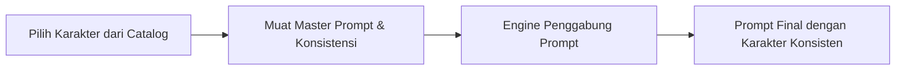

# ⭐ Panduan Fitur Utama - AI Poster Prompt Studio

Dokumen ini menjelaskan secara mendalam fitur-fitur utama yang membuat **AI Poster Prompt Studio** menjadi platform yang andal, aman, dan efisien untuk pembuatan materi promosi bertenaga AI.

---

## 🎭 1. Character Bible & Konsistensi Visual (Consistency Engine)

Salah satu masalah terbesar saat menggunakan generator gambar AI (seperti Bing Image Creator atau Midjourney) adalah **inkonsistensi karakter**—karakter yang sama sering kali terlihat berbeda ketika kita mengubah prompt.

AI Poster Prompt Studio memecahkan masalah ini dengan fitur **Character Bible**:

*   **Profil Karakter Terpusat**: Setiap karakter disimpan dengan detail fisik yang konsisten di database (jenis kelamin, perkiraan umur, gaya rambut, pakaian khas, ekspresi wajah, pose tubuh).
*   **Master Prompt & Prompt Konsistensi**: Menyediakan template deskripsi khusus yang telah diuji secara menyeluruh agar mesin AI selalu memahami dan merender karakter dengan kemiripan visual di atas 90%.
*   **Positive & Negative Prompts**: Menyertakan kata kunci pendukung untuk meningkatkan detail visual karakter dan kata kunci negatif untuk menghindari kecacatan render (seperti jari tangan ganda, wajah buram, atau proporsi aneh).

---

## 🎨 2. AI Prompt Engine & Dynamic Templates

Platform ini tidak hanya mengirimkan input mentah dari user ke AI, melainkan memprosesnya melalui **Template Engine** dinamis untuk memastikan output prompt memiliki struktur pemasaran yang viral:

*   **Templating Dinamis**: Admin dapat mengatur formula template prompt di Admin Portal. Template ini mendukung penanda variabel seperti `{{topic}}`, `{{style}}`, `{{character}}`, dll.
*   **Formula Pemasaran Viral**: Template secara otomatis menyisipkan pola *hooks* (kalimat pemikat perhatian di awal) yang diambil dari database untuk menarik audiens media sosial.
*   **Analisis Viralitas oleh Gemini**: Setelah Gemini menghasilkan prompt final, AI akan menganalisis prompt tersebut untuk memberikan:
    1.  **Viral Score (Skor Viralitas)**: Skala `1-100` berdasarkan potensi keterlibatan audiens.
    2.  **Viral Breakdown**: Analisis terperinci mengenai kekuatan visual, keunikan konsep, dan kesesuaian target pasar.

---

## 🔑 3. Kolam Rotasi API Key Gemini (API Key Rotation Pool)

Untuk memastikan aplikasi tetap dapat melayani permintaan generate prompt meskipun terjadi lonjakan lalu lintas pengguna, sistem backend mengelola kunci API dengan metode pintar:

*   **Enkripsi Kunci Aman**: Seluruh API Key dienkripsi menggunakan algoritma `AES-256-CBC` sebelum disimpan ke database, mencegah kebocoran kunci jika database diakses pihak tidak berwenang.
*   **Rotasi Kunci Otomatis**: Setiap request pemrosesan AI akan memilih kunci dengan ketentuan:
    -   Status aktif (`isActive = true`).
    -   Status kesehatan baik (`healthStatus = 'healthy'`).
    -   Diurutkan berdasarkan prioritas tertinggi (`priority`) dan jumlah pemakaian paling sedikit (`usageCount`).
*   **Circuit Breaker & Auto-healing**: Jika sebuah kunci menghasilkan error API (kuota habis, kunci tidak valid, atau diblokir), backend akan:
    1.  Menandai kunci tersebut secara otomatis sebagai `'dead'` di database.
    2.  Mencari kunci alternatif berikutnya yang sehat dari kolam.
    3.  Mengulangi proses request pembuat prompt tanpa membatalkan transaksi pengguna.
    4.  Mencatat jenis kegagalan di Log Audit Admin untuk ditinjau.

---

## 🎟️ 4. Sistem Kredit & Lisensi Voucher

Aplikasi ini menggunakan model bisnis berbasis kredit (*credit-based*) dan masa langganan (*subscription*) untuk membatasi kuota generate pengguna:

*   **Tipe Akun Pengguna**:
    *   `FREE`: Mendapatkan jatah kredit harian/awal yang terbatas (misalnya 10 kredit).
    *   `VIP/SUBSCRIBER`: Akun dengan masa aktif tertentu yang memiliki hak akses lebih luas dan prioritas antrean pemrosesan lebih tinggi.
*   **Klaim Voucher Lisensi**:
    -   Admin dapat membuat kode voucher unik (License Key) dengan spesifikasi masa berlaku (jumlah hari) dan jumlah kredit tambahan.
    -   Pengguna memasukkan kode lisensi melalui aplikasi Flutter Client pada halaman Subscription.
    -   Sistem melakukan validasi kode, jika valid: status akun di-upgrade ke VIP, kredit ditambahkan, kode voucher ditandai sebagai `isUsed = true`, dan data klaim dicatat di database.
